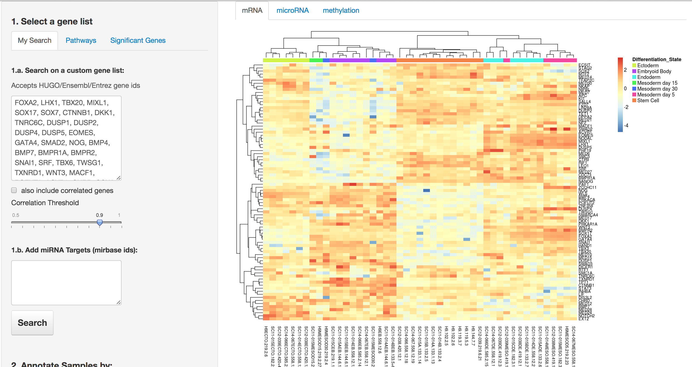
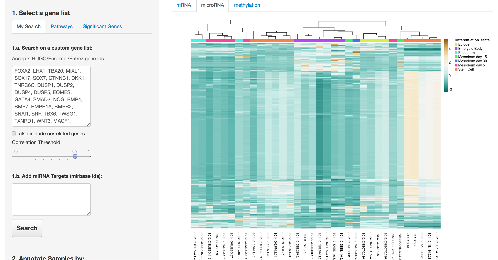
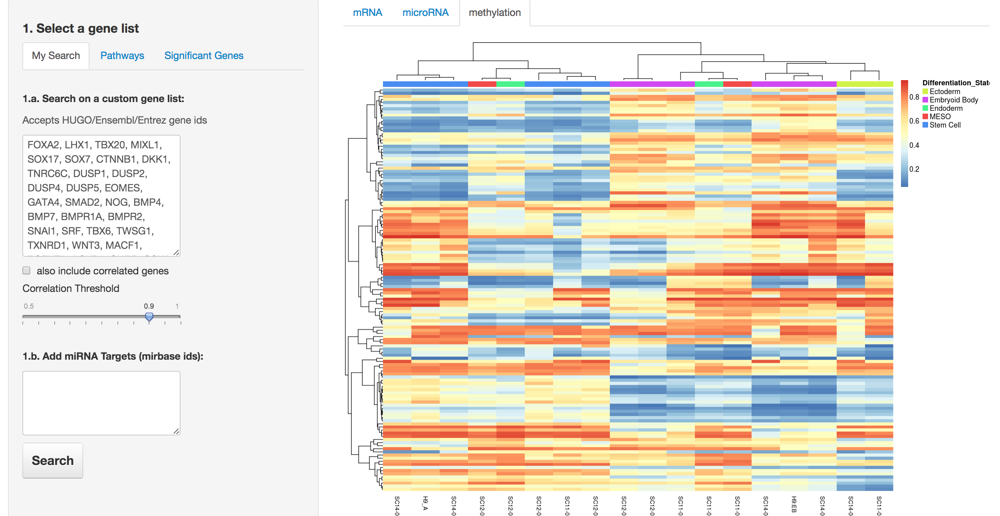

Interactive DataVis for PCBC Datasets hosted on [Synapse](https://www.synapse.org/#!Synapse:syn1773109)
==========================

Following is an example to search across mRNA, miRNA and methylation datasets given a feature list (mRNA/miRNA)

* Possible to color the samples different available metadata categories 
* Can filter/select samples 

##### 1. mRNA expression

##### 2. miRNA expression

##### 3. methylation

